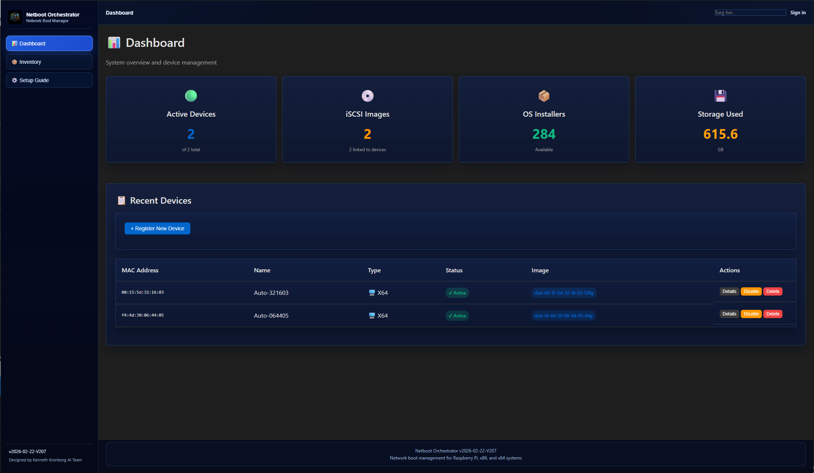
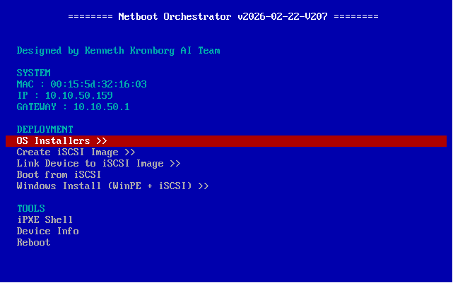
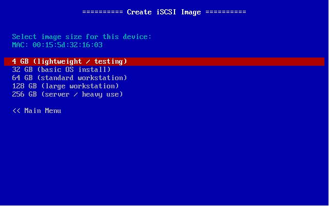
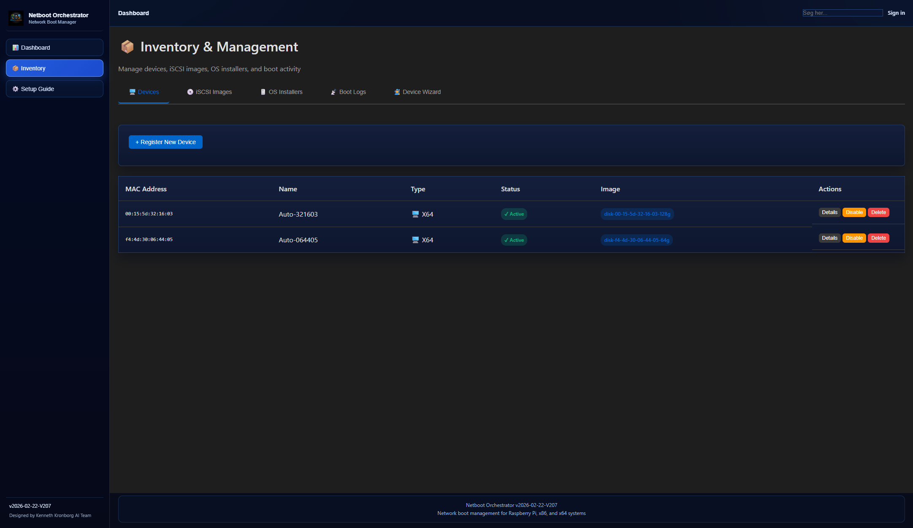
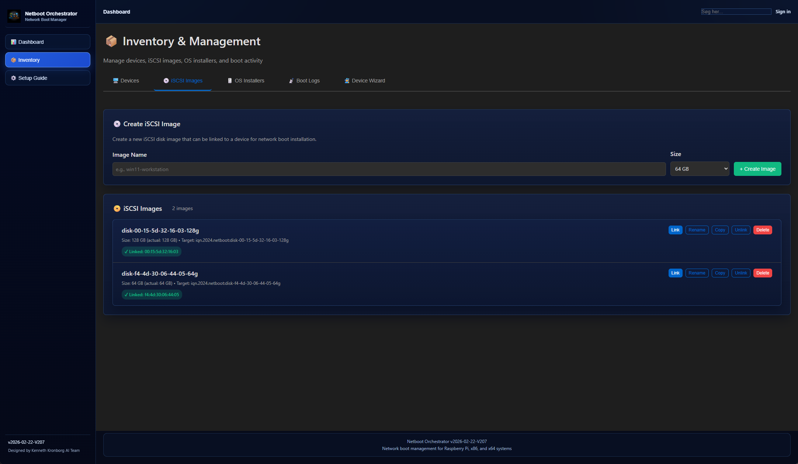
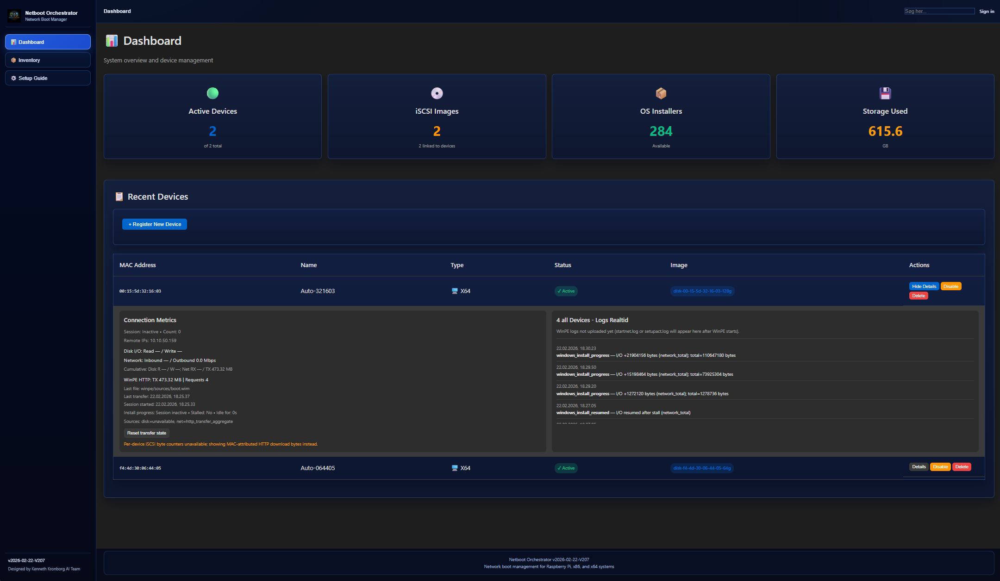
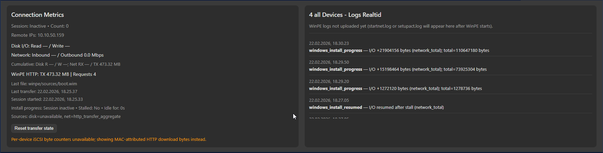

# Netboot Orchestrator

[](https://github.com/Kronborgs/netboot-orchestrator/releases)
[](https://github.com/Kronborgs/netboot-orchestrator)
[](LICENSE)

## What this is
Netboot Orchestrator is an all-in-one PXE and iSCSI deployment system for homelab and lab environments.
It gives you a boot menu (iPXE), a Web GUI, and backend automation to install or boot operating systems on network clients.



## What it can do today
- PXE boot with iPXE menus
- Manage iSCSI images (create, link, unlink, copy, rename)
- Boot devices directly from iSCSI
- Windows install flow (WinPE + iSCSI)
- Web GUI for inventory, image management, and setup guidance
- Realtime device logs and connection metrics
- Session-based telemetry with per-MAC attribution and debug endpoint

## What is planned next
- Better guided install flows for mixed client types
- Expanded diagnostics around Windows deployment steps
- More profile-based automation per device

## Quick start
### Option A: Unraid (recommended)
1. Pull image: `ghcr.io/kronborgs/netboot-orchestrator:latest`
2. Use host networking
3. Mount persistent data to `/data`
4. Set required env vars:
   - `BOOT_SERVER_IP`
   - `DHCP_SUBNETS`
   - `DHCP_RANGE_START`
   - `DHCP_RANGE_END`
5. Start container and open Web GUI at `http://<host-ip>:3000`

### Option B: Docker Compose
```bash
git clone https://github.com/Kronborgs/netboot-orchestrator.git
cd netboot-orchestrator
docker compose up -d --build
```
Then open:
- Web GUI: `http://localhost:3000`
- API docs: `http://localhost:8000/docs`

## Typical user workflow
1. Add OS installer files under your mounted data path
2. Open Web GUI and create/link iSCSI image to a device
3. PXE boot the target client
4. Select boot/install action from iPXE menu
5. Monitor logs and metrics in Web GUI during install









## Realtime metrics debug (advanced users)
Use this endpoint to inspect exactly which source/fallback each metric comes from per MAC:
- `GET /api/v1/boot/devices/metrics/debug`
- `GET /api/v1/boot/devices/metrics/debug?include_full=true`

This is useful when validating session attribution and fallback behavior across multiple clients.





## Documentation
- User quickstart: `docs/QUICKSTART.md`
- Deployment details: `docs/DEPLOYMENT.md`
- Unraid setup: `docs/UNRAID.md`
- Data structures: `docs/DATA_STRUCTURE.md`
- Boot flow: `docs/BOOT_FLOW.md`
- Full technical handoff and architecture: `PROJECT_GUIDE.md`

## Versioning
- Runtime version source-of-truth is the `VERSION` file in the repository/image
- Current version: `2026-02-22-V207`

## Support
For issues and feature requests, use GitHub Issues.
